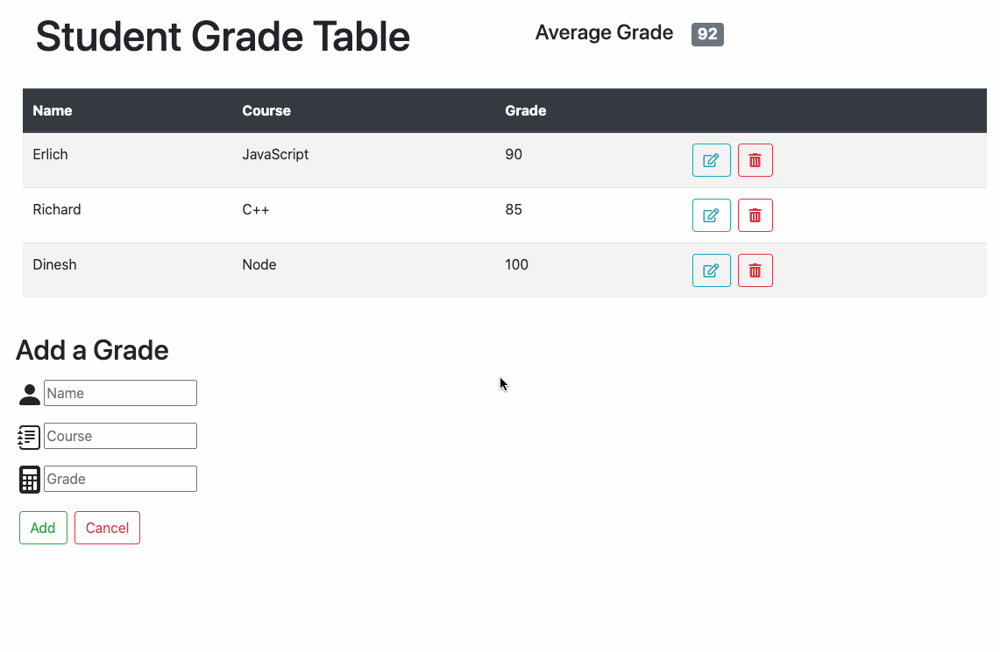

# sgt

This is a dynamic web application for teachers who want to record the grades of their students.

## Live Site
Try the live stie at: http://sgt.brandonktran.com/

## Technologies Used
React.js  
Node.js  
json-server  
Babel  
Webpack  
Bootstrap  
HTML  
CSS

## Main Features
User can add a grade  
User can delete a grade  
User can edit a grade  
User can view grades  
